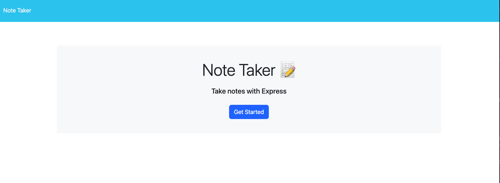
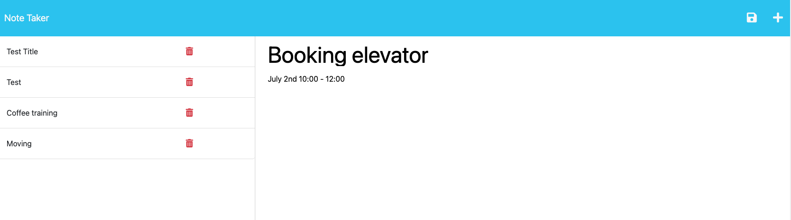

# Note-Taker
## Description
To create an application called Note Taker that can be used to write and save notes. This application will use an Express.js back end and will save and retrieve note data from a JSON file.

## Table of Contents
* [Installation](#installation)
* [Usage](#usage)
* [Contributors](#Contributors)
* [Link](#link)
* [License](#license)

## Installation
Express and uuid package

## Usage

Open the Note Taker, I am presented with a landing page with a link to a notes page.

1.Click on the link to the notes page
I am presented with a page with existing notes listed in the left-hand column, plus empty fields to enter a new note title and the note’s text in the right-hand column

2.Enter a new note title and the note’s text
A Save icon appears in the navigation at the top of the page

3.Click on the Save icon
The new note I have entered is saved and appears in the left-hand column with the other existing notes

4.Click on an existing note in the list in the left-hand column
That note appears in the right-hand column

5.Click on the Write icon in the navigation at the top of the page
I am presented with empty fields to enter a new note title and the note’s text in the right-hand column

6.Delete the note
Click the delete icon you to delete the note

## Contributors
Starter code: Xandromus, Georgeyoo

## Link
[Github repository](https://github.com/Shok1to/Note-Taker)
[Note Taker URL](https://powerful-crag-07881-ccf657f26c19.herokuapp.com/)

## License

